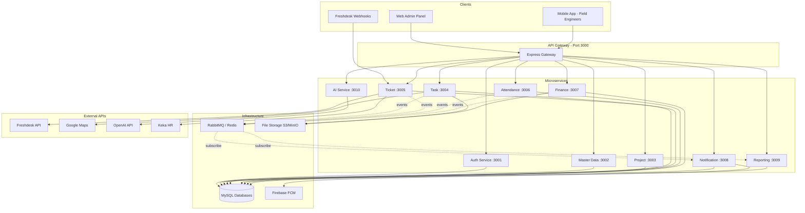

# FSM Microservices — Architecture Overview

## System Context



---

## Service Boundaries

### Dependency Graph

```
                    ┌──────────────┐
                    │  API Gateway │
                    └──────┬───────┘
                           │
         ┌─────────────────┼─────────────────┐
         ▼                 ▼                 ▼
   ┌───────────┐    ┌────────────┐    ┌──────────┐
   │   Auth    │    │ Master Data│    │ Reporting│
   │  Service  │    │  Service   │    │ (read)   │
   └─────┬─────┘    └─────┬──────┘    └──────────┘
         │                │
         │    ┌───────────┼───────────┐
         │    ▼           ▼           ▼
         │ ┌────────┐ ┌───────┐ ┌─────────┐
         │ │Project │ │ Ticket│ │Attendance│
         │ └───┬────┘ └───┬───┘ └────┬────┘
         │     │          │          │
         │     ▼          ▼          ▼
         │ ┌──────────────────────────────┐
         │ │         Task Service          │
         │ └──────────────┬───────────────┘
         │                ▼
         │         ┌────────────┐
         │         │  Finance   │
         │         └────────────┘
         │
         ▼
   ┌─────────────┐    ┌──────────┐
   │Notification │    │AI Service│
   └─────────────┘    └──────────┘
```

### Coupling Levels

| Service | Depends On | Coupling |
|---------|-----------|----------|
| API Gateway | All services (proxy) | Low |
| Auth | None | None |
| Master Data | Auth (user context) | Low |
| Project | Auth, Master Data | Medium |
| Task | Auth, Project, Master Data | High |
| Ticket | Auth, Master Data, Task | High |
| Attendance | Auth, Task (shared entity) | High |
| Finance | Auth, Task | Medium |
| Notification | Auth (FCM tokens) | Low |
| Reporting | All (read-only) | Low |
| AI | None | None |

---

## Communication Patterns

### Pattern 1: API Gateway Proxy (External → Service)

All client requests go through the gateway. The gateway validates JWT and forwards to the correct service.

```
Mobile App → POST /api/tasks → Gateway → task-service:3004/tasks
```

### Pattern 2: Synchronous REST (Service → Service)

When one service needs data from another during a request:

```javascript
// task-service calling auth-service
const user = await httpClient.get(`${AUTH_SERVICE_URL}/internal/users/${userId}`);
```

Use `/internal/` prefix for service-to-service endpoints (not exposed via gateway).

### Pattern 3: Async Events (Service → Event Bus → Service)

For side effects that don't need immediate response:

```
task-service publishes "task.checked_out"
  → finance-service creates conveyance claim
  → notification-service sends push to manager
  → reporting-service updates read model
```

---

## Database Architecture

### Database-per-Service

```
MySQL Server
├── fsm_auth           (users, roles, loginlogs)
├── fsm_master_data    (companies, contacts, branches, products)
├── fsm_projects       (projects, projectassignees)
├── fsm_tasks          (tasks, tasktypes, locationtracking)
├── fsm_tickets        (tickets, ticketstatuses, ticketconditions)
├── fsm_attendance     (attendanceconfigs, attendancelogs)
├── fsm_finance        (claims, conveyanceconfigs)
├── fsm_notifications  (firebaseinboxes)
└── fsm_reporting      (read models, materialized views)
```

### Cross-Service Data Access Rules

1. **Never** query another service's database directly
2. Use REST API for synchronous reads
3. Use events to maintain local copies (eventual consistency)
4. Reporting service uses read replicas or event-sourced projections

---

## Security Architecture

```
┌─────────────────────────────────────────────┐
│                  API Gateway                 │
│  ┌─────────┐  ┌──────────┐  ┌───────────┐  │
│  │  CORS   │  │  Helmet  │  │Rate Limit │  │
│  └─────────┘  └──────────┘  └───────────┘  │
│  ┌─────────────────────────────────────┐    │
│  │     JWT Validation (shared secret)   │    │
│  └─────────────────────────────────────┘    │
└──────────────────┬──────────────────────────┘
                   │ X-User-Id, X-Role-Id headers
                   ▼
            ┌──────────────┐
            │   Service    │
            │ (trusts GW)  │
            └──────────────┘
```

- JWT issued by **auth-service** only
- Gateway validates JWT and passes `X-User-Id`, `X-Role-Id` headers to services
- Services trust gateway headers (internal network only)
- `/internal/*` endpoints require service-to-service API key
- Freshdesk webhooks validated by ticket-service (API key in header)

---

## Deployment Architecture

### Development (Docker Compose)

```
docker-compose.yml
├── api-gateway         (port 3000)
├── auth-service        (port 3001)
├── master-data-service (port 3002)
├── ... (all 11 services)
├── mysql               (port 3306)
├── rabbitmq            (port 5672)
└── minio               (port 9000)
```

### Production (Kubernetes)

```
Namespace: fsm-production
├── Deployment: api-gateway (2 replicas, HPA)
├── Deployment: auth-service (2 replicas)
├── Deployment: each service (1-2 replicas based on load)
├── StatefulSet: mysql (or managed RDS)
├── Deployment: rabbitmq
├── Ingress: nginx-ingress → api-gateway
├── ConfigMap: shared env vars
└── Secret: JWT_SECRET, API keys
```

---

## Observability

| Concern | Tool | Notes |
|---------|------|-------|
| Logging | Winston + centralized (ELK/Loki) | Correlation ID per request |
| Monitoring | Prometheus + Grafana | Per-service metrics |
| Tracing | OpenTelemetry / Jaeger | Cross-service request tracing |
| Health | `/health` endpoint per service | Gateway aggregates health |
| Alerts | Grafana alerts | Service down, high latency, DB connection failures |

---

## File Storage Strategy

### Current (Monolith)
All files in local `uploads/` directory.

### Target (Microservices)
Shared object storage accessible by all services:

```
S3/MinIO Bucket: fsm-uploads/
├── profiles/          (auth-service)
├── task-attachments/  (task-service)
├── claim-receipts/    (finance-service)
├── voice-notes/       (ai-service)
└── task-type-icons/   (task-service)
```

Migration: Copy `uploads/` to S3, update `BASE_URL` env var.
